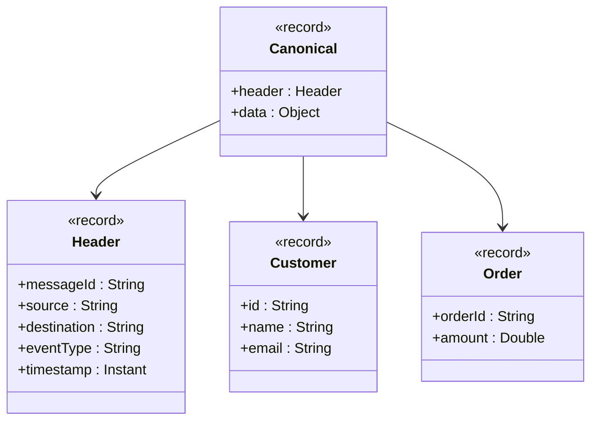

# Commons

Commons es una librería Java que reúne patrones y utilidades comunes para proyectos modernos, enfocada en manejo funcional de errores, estructuras canónicas de mensajes y comandos desacoplados.

## Incluye:

- __Result Pattern__ (Success, Failure) para representar operaciones con éxito o fallo de forma expresiva y segura.
- __Excepciones de negocio y técnicas__ (BusinessException, TechnicalException) para diferenciar claramente los tipos de error.
- __Modelo canónico__ (Header, Canonical<T>) que estandariza el intercambio de mensajes con metadata y payload.
- __Patrón Command__ (Command<T>) para encapsular acciones y devolver resultados consistentes.
- __Tests unitarios__ con JUnit 5 y AssertJ para garantizar calidad y confiabilidad.

## Patrón Result con Sealed Interfaces en Java 25

El patrón __Result__ es una forma explícita de manejar operaciones que pueden fallar, encapsulando tanto el éxito como el error en un mismo tipo. En Java 25 podemos aprovechar los __sealed interfaces__ y los __records__ para implementar este patrón de manera segura y expresiva. Además, podemos enriquecerlo haciendo que Failure contenga directamente una excepción, lo que permite diferenciar entre errores de negocio y errores técnicos.

## 📌 Implementación

````java
// Result.java
public sealed interface Result<T> permits Success, Failure {
    boolean isSuccess();
    boolean isFailure();

    <U> Result<U> map(java.util.function.Function<? super T, ? extends U> mapper);
    <U> Result<U> flatMap(java.util.function.Function<? super T, Result<U>> mapper);
}

public record Success<T>(T value) implements Result<T> {
    @Override
    public boolean isSuccess() { return true; }
    @Override
    public boolean isFailure() { return false; }

    @Override
    public <U> Result<U> map(java.util.function.Function<? super T, ? extends U> mapper) {
        return new Success<>(mapper.apply(value));
    }

    @Override
    public <U> Result<U> flatMap(java.util.function.Function<? super T, Result<U>> mapper) {
        return mapper.apply(value);
    }
}

public record Failure<T>(Exception exception) implements Result<T> {
    @Override
    public boolean isSuccess() { return false; }
    @Override
    public boolean isFailure() { return true; }

    @Override
    public <U> Result<U> map(java.util.function.Function<? super T, ? extends U> mapper) {
        return new Failure<>(exception);
    }

    @Override
    public <U> Result<U> flatMap(java.util.function.Function<? super T, Result<U>> mapper) {
        return new Failure<>(exception);
    }
}
````

## 📖 Excepciones personalizadas

````java
public class BusinessException extends Exception {
    public BusinessException(String message) { super(message); }
}

public class TechnicalException extends Exception {
    public TechnicalException(String message) { super(message); }
}
````

## 📖 Ejemplo de uso

````java
public Result<Integer> safeDivide(int numerator, int denominator) {
    if (denominator == 0) {
        return new Failure<>(new BusinessException("División por cero"));
    }
    try {
        return new Success<>(numerator / denominator);
    } catch (Exception e) {
        return new Failure<>(new TechnicalException("Error inesperado: " + e.getMessage()));
    }
}

public static void main(String[] args) {
    Result<Integer> result = new MyService().safeDivide(10, 0);

    switch (result) {
        case Success<Integer> s -> System.out.println("Resultado: " + s.value());
        case Failure<Integer> f -> {
            Exception ex = f.exception();
            if (ex instanceof BusinessException) {
                System.out.println("Error de negocio: " + ex.getMessage());
            } else if (ex instanceof TechnicalException) {
                System.out.println("Error técnico: " + ex.getMessage());
            }
        }
    }
}
````

## 🔹 Uso asincrónico con CompletableFuture

````java
import java.util.concurrent.CompletableFuture;

public CompletableFuture<Result<Integer>> asyncDivide(int numerator, int denominator) {
    return CompletableFuture.supplyAsync(() -> safeDivide(numerator, denominator));
}

public static void main(String[] args) {
    new MyService().asyncDivide(10, 0)
        .thenApply(result -> switch (result) {
            case Success<Integer> s -> "Resultado: " + s.value();
            case Failure<Integer> f -> "Error: " + f.exception().getMessage();
        })
        .thenAccept(System.out::println);
}
````

## Diagrama de Clases del Patrón Result

```mermaid
classDiagram
    class Result {
        <<interface>>
        +isSuccess() boolean
        +isFailure() boolean
        +map(Function) Result
        +flatMap(Function) Result
    }

    class Success {
        <<record>>
        +value : Object
    }

    class Failure {
        <<record>>
        +exception : Exception
    }

    Result <|-- Success
    Result <|-- Failure

    class BusinessException {
        <<class>>
    }

    class TechnicalException {
        <<class>>
    }

    Failure --> Exception
    Exception <|-- BusinessException
    Exception <|-- TechnicalException
````

## Diagrama de Secuencia: safeDivide con Result

```mermaid
sequenceDiagram
    participant Cliente
    participant Servicio
    participant Result

    Cliente->>Servicio: safeDivide(10, 0)
    Servicio->>Result: new Failure(BusinessException)
    Result-->>Cliente: Failure con excepción

    Cliente->>Servicio: safeDivide(10, 2)
    Servicio->>Result: new Success(5)
    Result-->>Cliente: Success con valor
```

---

## 📌 Explicación
- El **Cliente** invoca el método `safeDivide`.
- El **Servicio** devuelve un `Result`, que puede ser:
    - `Failure` con una excepción (`BusinessException` o `TechnicalException`).
    - `Success` con el valor correcto.
- El **Cliente** recibe el `Result` y lo maneja con `switch` o con `map/flatMap`.

---

## Diagrama de Clases del Objeto Canónico



---

## 📌 Explicación
- **Canonical**: objeto genérico que siempre tiene un `Header` y un `data`.
- **Header**: metadatos comunes (origen, destino, tipo de evento, etc.).
- **Customer / Order**: ejemplos de objetos de negocio que pueden ir en `data`.
- La flecha indica que `Canonical` contiene tanto el `Header` como el objeto de negocio.

---

## ✅ Ventajas

- __Seguridad de tipos:__ el compilador garantiza que solo existen dos variantes (Success y Failure).
- __Pattern Matching:__ el switch obliga a cubrir todos los casos posibles.
- __Estilo funcional:__ gracias a map y flatMap, se pueden encadenar operaciones de manera declarativa.
- __Inmutabilidad:__ los record son inmutables y concisos.
- __Excepciones enriquecidas:__ Failure puede contener excepciones personalizadas (BusinessException, TechnicalException).
- __Versatilidad:__ se puede usar tanto en contextos síncronos como asincrónicos.

## 📌 Conclusión

El patrón Result con sealed interfaces en Java 25 es una forma moderna y segura de manejar errores sin abusar de excepciones. Al permitir que Failure contenga excepciones personalizadas, se logra un manejo más expresivo y flexible, ideal para separar claramente errores de negocio y errores técnicos.
